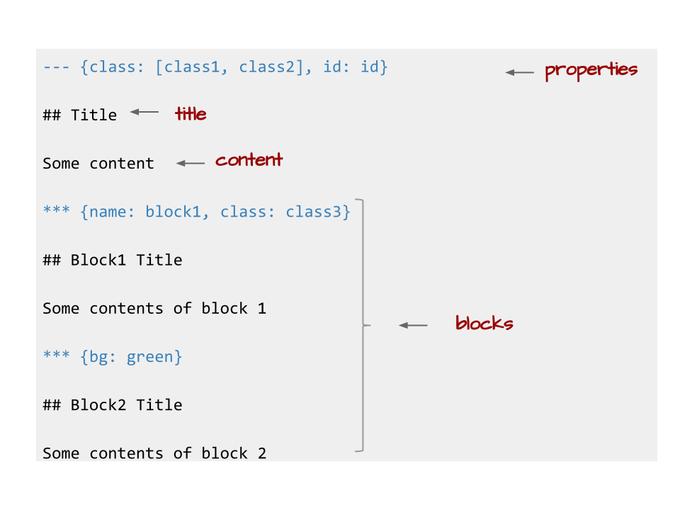
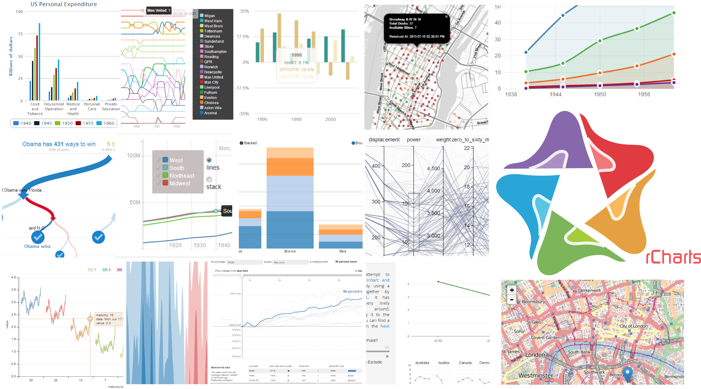

## Install Slidify

Slidify is not on CRAN and needs to be installed from `github` using the `devtools` package. I would recommend installing the `dev` version of the package.

```r
# install.packages('devtools')
pkgs <- c("slidify", "slidifyLibraries", "rCharts")
install_github(pkgs, 'ramnathv', ref = 'dev')
```

NOTE: While the installation process from `github` is relatively painless for Mac/Linux/Ubuntu users, it can make Windows users jump through hoops. For those of you on Windows that hit a bottleneck, here is an [excellent blog post](http://thiagosilva.wordpress.com/2013/02/17/installing-slidify-on-a-windows-machine/) that takes you through an alternate installation process that has been reported to work well.

--- .nobackground .quote

<q> Slidify helps __create__, customize and share, elegant, dynamic and interactive HTML5 documents using R Markdown.</q>

---

<iframe src='assets/img/create_deck.svg' width=960px></iframe>

--- .segue bg:blue

## Demo 1 | Create

--- .nobackground .quote

<q> Slidify helps create, __customize__ and share, elegant, dynamic and interactive HTML5 documents using R Markdown.</q>

---

## Customization

Slidify is highly modular and attempts to achieve clean separation of content from view and behavior. There are several ways to customize a document.

> 1. Frameworks
> 2. Layouts
> 3. Widgets

--- .segue bg:blue

## Demo 2 | Frameworks

--- .segue bg:indigo

## How Slidify Works?

---

<iframe src='assets/img/knit.svg' width=800px height=250px>
</iframe> 

---

<iframe src='assets/img/split_apply_combine.svg' width=800px height=250px>
</iframe> 


---

<iframe src='assets/img/split.svg' width=800px height=250px>
</iframe> 

---

<iframe src='assets/img/apply.svg' width=800px height=250px>
</iframe> 


---

<iframe src='assets/img/combine.svg' width=800px height=250px>
</iframe> 

--- .segue bg:indigo

## Journey of a Slide

--- .bigger

## Slide

```{r echo = F, comment = NA, cache = F, results = 'hide'}
slide <- '--- {class: class1, bg: yellow, id: id1}

## Slide Title

Slide Contents

*** =pnotes

Some notes'
```

    --- {class: class1, bg: yellow, id: id1}
    
    ## Slide Title
    
    Slide Contents
    
    *** =pnotes
    
    Some notes

---

<iframe src='assets/img/raw_slide.svg' width=800px height=250px>
</iframe> 

---

<a class='example'>Payload</a>

```{r echo = F, comment = NA}
payload <- slidify:::parse_slide(slide)
payload
```

---

<iframe src='assets/img/parse_slide.svg' width=800px height=250px>
</iframe> 


--- .RAW .bigger

<a class='example'>Layout</a>

```{r echo = F, comment = NA}
layout <- slidify:::read_file('libraries/frameworks/io2012/layouts/slide.html')
cat(layout)
```

---

<iframe src='assets/img/layout_slide.svg' width=800px height=250px>
</iframe> 

--- .bigger

<a class='example'>Rendered</a>

```{r render, echo = F, comment = NA}
rendered = rCharts::render_template(layout, list(slide = payload))
cat(rendered)
```

---

<iframe src='assets/img/render_slide.svg' width=800px height=250px>
</iframe> 

--- {class: class1, bg: yellow, id: id1}
    
## Slide Title
    
Slide Contents
    
*** =pnotes
    
Some notes

--- .segue .nobackground .dark

## Slide Properties

---

</img> 

---

## Slide Properties

| **Variable**    | **Description**                       |
|-----------------|---------------------------------------|
| `slide.title`   | The title of the slide with no markup |
| `slide.header`  | The title of the slide with markup    |
| `slide.level`   | The title header level (h1 - h6)      |
| `slide.content` | The contents of the slide sans header |
| `slide.html`    | The contents of the slide with header |
| `slide.num`     | The number of the slide               |
| `slide.id`      | The id assigned to the slide          |
| `slide.class`   | The class assigned to the slide       |
| `slide.bg`      | The background assigned to the slide  |
| `slide.myblock`   | The slide block named myblock       |
| `slide.blocks`  | The slide blocks which are not named  |
| `slide.rendered`| The rendered slide                    |

---

## Carousel Slide

<a class='example'>slide</a>

    --- &carousel .span12
    
    ## Carousel
    
    
    *** {class: active, img: "http://placehold.it/960x500"}
    
    Image 1
    
    *** {img: "http://placehold.it/960x500"}
    
    Image 2


--- .RAW .smaller

<a class='example'>layout</a>

```{r results = 'asis', echo = F}
writeLines(paste('   ', readLines('assets/layouts/carousel.html')))
```


--- &carousel .span12 #mycarouselslide

<a class='example'>view</a>


*** {class: active, img: "assets/img/split.svg"}

Image 1

*** {img: "assets/img/apply.svg"}

Image 2

<style>
#mycarouselslide img {
  width: 800px;
  height: 600px;
}
</style>

--- .nobackground .quote

<q> Slidify helps create, customize and __share__, elegant, dynamic and interactive HTML5 documents using R Markdown.</q>

--- .bigger

## Publish

Share your document easily on [github](http://github.com), [rpubs](http://rpubs.com) and [dropbox](http://dropbox.com)

```
slidify('index.Rmd')
publish('mydeck', 'ramnathv')
```

--- .nobackground .quote

<q> Slidify helps create, customize and share, elegant, __dynamic__ and interactive HTML5 documents using R Markdown.</q>

---

## Dynamic

```{r echo = F, comment = NA, results = 'asis'}
include('include/reproducible.txt')
```

---

```{r child = 'include/reproducible.txt'}
```

---

## HT to knitr and @yihui


--- .nobackground .quote

<q> Slidify helps create, customize and share, elegant, dynamic and __interactive__ HTML5 documents using R Markdown.</q>

---

## Interactive Quiz

    --- &radio  
    ## Interactive Quiz
    
    What is 1 + 1?
    
    1. 1 
    2. _2_
    3. 3
    4. 4
    
    *** .hint
    
    This is a hint
    
    *** .explanation
    
    This is an explanation

--- &radio

## Interactive Quiz

What is 1 + 1?

1. 1 
2. _2_
3. 3
4. 4

*** .hint

This is a hint

*** .explanation

This is an explanation

--- .bigger

## Interactive Chart

```{r ichart, results = 'hide', tidy = F, message = F}
require(rCharts)
haireye = as.data.frame(HairEyeColor)
n1 <- nPlot(Freq ~ Hair, 
  group = 'Eye',
  data = subset(haireye, Sex == 'Male'),
  type = 'multiBarChart'
)
n1$print('chart1')
```

---

## Interactive Chart

```{r ref.label = 'ichart', results = 'asis', echo = F}

```

--- .segue bg:blue

## Interactive Slides Demo

--- .segue .dark

## Interactive Visualizations

--- .fill .nobackground



--- .quote

<q>rCharts is an R package to create, customize and share interactive visualizations, using a lattice-like formula interface.</q>

--- .segue .dark .nobackground

## rCharts Demos

---

## Basic Plot

```{r chart1, eval = F, tidy = F, results = 'hide'}
r1 <- rPlot(mpg ~ wt | am + vs, 
  data = mtcars, 
  color = 'gear',
  type = 'point'
)
r1
```

---

```{r ref.label = 'chart1', results = 'asis', echo = F}
```

---

## Add Controls

```{r chart2, eval = F, tidy = F, results = 'hide'}
r1$addControls("x", "wt", names(mtcars))
r1$addControls("y", "mpg", names(mtcars))
r1
```

---

```{r ref.label = 'chart2', results = 'asis', echo = F}
```

--- .segue .dark .nobackground

## [NYT Home Prices](http://www.nytimes.com/interactive/2011/05/31/business/economy/case-shiller-index.html)

--- &tabs

## Get Data


*** 

## Code

```{r results = 'asis'}
require(PerformanceAnalytics)
data(managers)
managers <- na.omit(managers)
data_ = data.frame(
  date = format(index(managers), "%Y-%m-%d"),
  coredata(cumprod(managers + 1)*100)
)
```

*** .active

## Data

```{r results = 'asis', echo = F}
require(xtable)
options(xtable.type = 'html', xtable.include.rownames = F)
xtable(head(data_, 10))
```


--- .bigger &tabs

## Process Data

*** 

## Code

```{r}
require(reshape2)
# melt data frame into long form
data_m <- melt(data_, id = "date", 
  variable.name = 'manager', 
  value.name = 'val'
)
```

*** .active

## Data

```{r results = 'asis', echo = F}
xtable(head(data_m, 10))
```

--- .bigger

## Visualize Data

```{r nythome2, results = 'hide'}
require(rCharts)

# initialize chart and set path to chart library
p2 <- rCharts$new()
p2$setLib('libraries/widgets/nyt_home')

# pass description, plot data and groups variable
p2$set(
  description = "This data comes from the managers dataset 
  included in the R package PerformanceAnalytics.",
  data = data_m,
  groups = "manager",
  height = 0,
  width = 0
)
p2
```

---

```{r ref.label = 'nythome2', echo = F, results = 'asis'}

```


---

## Credits

1. Kenton Russel and Thomas Reinholdsson for coauthoring rCharts.
2. Yihui Xie for knitr.
3. Joe Cheng for Shiny.
4. Jeffrey Horner and RStudio for Markdown.
5. Hadley Wickham for several R packages.
6. Authors of all the JS Libraries I have liberally used.
7. Authors of several presentation libraries in Ruby/Python/JS.


