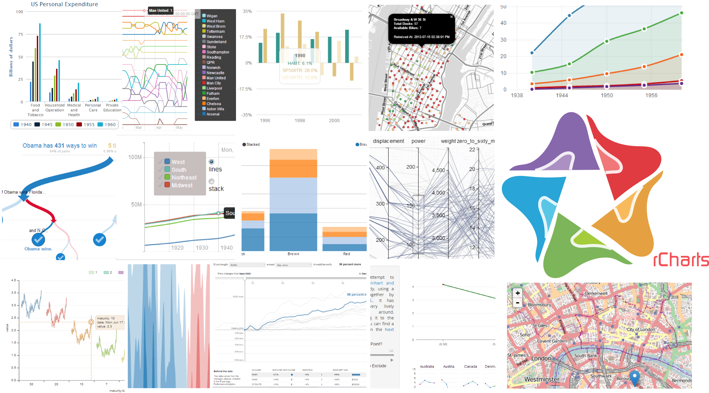

## Install Slidify

Slidify is not on CRAN and needs to be installed from `github` using the `devtools` package. I would recommend installing the `dev` version of the package.

```r
# install.packages('devtools')
pkgs <- c("slidify", "slidifyLibraries", "rCharts")
install_github(pkgs, 'ramnathv', ref = 'dev')
```

NOTE: While the installation process from `github` is relatively painless for Mac/Linux/Ubuntu users, it can make Windows users jump through hoops. For those of you on Windows that hit a bottleneck, here is an [excellent blog post](http://thiagosilva.wordpress.com/2013/02/17/installing-slidify-on-a-windows-machine/) that takes you through an alternate installation process that has been reported to work well.

--- .nobackground .quote

<q> Slidify helps __create__, customize and share, elegant, dynamic and interactive HTML5 documents using R Markdown.</q>

---

<iframe src='assets/img/create_deck.svg' width=960px></iframe>

--- .segue bg:blue

## Demo 1 | Create

--- .nobackground .quote

<q> Slidify helps create, __customize__ and share, elegant, dynamic and interactive HTML5 documents using R Markdown.</q>

---

## Customization

Slidify is highly modular and attempts to achieve clean separation of content from view and behavior. There are several ways to customize a document.

> 1. Frameworks
> 2. Layouts
> 3. Widgets

--- .segue bg:blue

## Demo 2 | Frameworks

--- .segue bg:indigo

## How Slidify Works?

---

<iframe src='assets/img/knit.svg' width=800px height=250px>
</iframe> 

---

<iframe src='assets/img/split_apply_combine.svg' width=800px height=250px>
</iframe> 


---

<iframe src='assets/img/split.svg' width=800px height=250px>
</iframe> 

---

<iframe src='assets/img/apply.svg' width=800px height=250px>
</iframe> 


---

<iframe src='assets/img/combine.svg' width=800px height=250px>
</iframe> 

--- .segue bg:indigo

## Journey of a Slide

--- .bigger

## Slide


    --- {class: class1, bg: yellow, id: id1}
    
    ## Slide Title
    
    Slide Contents
    
    *** =pnotes
    
    Some notes

---

<iframe src='assets/img/raw_slide.svg' width=800px height=250px>
</iframe> 

---

<a class='example'>Payload</a>


```
$html
[1] "<h2>Slide Title</h2>\n\n<p>Slide Contents</p>\n"

$header
[1] "<h2>Slide Title</h2>"

$level
[1] "2"

$title
[1] "Slide Title"

$content
[1] "<p>Slide Contents</p>\n"

$class
[1] "class1"

$bg
[1] "yellow"

$id
[1] "id1"

$pnotes
$pnotes$html
[1] "<p>Some notes</p>\n"

$pnotes$level
[1] ""

$pnotes$title
[1] ""

$pnotes$content
[1] "<p>Some notes</p>\n"

$pnotes$name
[1] "pnotes"


$blocks
list()
```


---

<iframe src='assets/img/parse_slide.svg' width=800px height=250px>
</iframe> 


--- .RAW .bigger

<a class='example'>Layout</a>


```
<slide class="{{ slide.class }}" id="{{ slide.id }}" style="background:{{{ slide.bg }}};">
  {{# slide.header }}
  <hgroup>
    {{{ slide.header}}}
  </hgroup>
  {{/ slide.header }}
  <article data-timings="{{ slide.dt }}">
    {{{ slide.content }}}
  </article>
  <!-- Presenter Notes -->
  {{# slide.pnotes }}
  <aside class="note" id="{{ id }}">
    <section>
      {{{ html }}}
    </section>
  </aside>
  {{/ slide.pnotes }}
</slide>
```


---

<iframe src='assets/img/layout_slide.svg' width=800px height=250px>
</iframe> 

--- .bigger

<a class='example'>Rendered</a>


```
<slide class="class1" id="id1" style="background:yellow;">
  <hgroup>
    <h2>Slide Title</h2>
  </hgroup>
  <article data-timings="">
    <p>Slide Contents</p>

  </article>
  <!-- Presenter Notes -->
  <aside class="note" id="">
    <section>
      <p>Some notes</p>

    </section>
  </aside>
</slide>
```


---

<iframe src='assets/img/render_slide.svg' width=800px height=250px>
</iframe> 

--- {class: class1, bg: yellow, id: id1}
    
## Slide Title
    
Slide Contents
    
*** =pnotes
    
Some notes

--- .segue .nobackground .dark

## Slide Properties

---

</img> 

---

## Slide Properties

| **Variable**    | **Description**                       |
|-----------------|---------------------------------------|
| `slide.title`   | The title of the slide with no markup |
| `slide.header`  | The title of the slide with markup    |
| `slide.level`   | The title header level (h1 - h6)      |
| `slide.content` | The contents of the slide sans header |
| `slide.html`    | The contents of the slide with header |
| `slide.num`     | The number of the slide               |
| `slide.id`      | The id assigned to the slide          |
| `slide.class`   | The class assigned to the slide       |
| `slide.bg`      | The background assigned to the slide  |
| `slide.myblock`   | The slide block named myblock       |
| `slide.blocks`  | The slide blocks which are not named  |
| `slide.rendered`| The rendered slide                    |

---

## Carousel Slide

<a class='example'>slide</a>

    --- &carousel .span12
    
    ## Carousel
    
    
    *** {class: active, img: "http://placehold.it/960x500"}
    
    Image 1
    
    *** {img: "http://placehold.it/960x500"}
    
    Image 2


--- .RAW .smaller

<a class='example'>layout</a>

    ---
    layout: slide
    ---
    
    {{{ slide.content }}}
    <div id="{{slide.id}}-carousel" class="carousel slide {{slide.class}}">
      <!-- Indicators -->
      <ol class="carousel-indicators">
        {{# slide.blocks }}
        <li data-target="#{{slide.id}}-carousel" data-slide-to="{{num}}" class="{{class}}"></li>
        {{/ slide.blocks }}
      </ol>
      <!-- Wrapper for slides -->
      <div class="carousel-inner">
        {{# slide.blocks }}
        <div class="item {{class}}">
          
          <div class="carousel-caption">{{{ content }}}</div>
        </div>
        {{/ slide.blocks }}
      </div>
      <!-- Controls -->
      <a class="left carousel-control" href="#{{slide.id}}-carousel" data-slide="prev">&lsaquo;</a>
      <a class="right carousel-control" href="#{{slide.id}}-carousel" data-slide="next">&rsaquo;</a>
    </div>


--- &carousel .span12 #mycarouselslide

<a class='example'>view</a>


*** {class: active, img: "assets/img/split.svg"}

Image 1

*** {img: "assets/img/apply.svg"}

Image 2

<style>
#mycarouselslide img {
  width: 800px;
  height: 600px;
}
</style>

--- .nobackground .quote

<q> Slidify helps create, customize and __share__, elegant, dynamic and interactive HTML5 documents using R Markdown.</q>

--- .bigger

## Publish

Share your document easily on [github](http://github.com), [rpubs](http://rpubs.com) and [dropbox](http://dropbox.com)

```
slidify('index.Rmd')
publish('mydeck', 'ramnathv')
```

--- .nobackground .quote

<q> Slidify helps create, customize and share, elegant, __dynamic__ and interactive HTML5 documents using R Markdown.</q>

---

## Dynamic

     ## A Simple Plot
       
     ```{r simple-plot, fig.height = 6, fig.align = 'center', message = F}
     require(ggplot2)
     qplot(wt, mpg, data = mtcars)
     ```
     
     ---
     
     ## MotionPlot
     
     ```{r results = 'asis', commment = NA, message = F, echo = F}
     require(googleVis)
     M1 <- gvisMotionChart(Fruits, idvar="Fruit", timevar="Year")
     print(M1, tag = 'chart')
     ```
     


---


## A Simple Plot
  

```r
require(ggplot2)
qplot(wt, mpg, data = mtcars)
```


---

## MotionPlot

<!-- MotionChart generated in R 3.0.1 by googleVis 0.4.5 package -->
<!-- Sun Sep 22 19:41:19 2013 -->


<!-- jsHeader -->
<script type="text/javascript">
 
// jsData 
function gvisDataMotionChartID1591607a229 () {
var data = new google.visualization.DataTable();
var datajson =
[
 [
 "Apples",
2008,
"West",
98,
78,
20,
"2008-12-31" 
],
[
 "Apples",
2009,
"West",
111,
79,
32,
"2009-12-31" 
],
[
 "Apples",
2010,
"West",
89,
76,
13,
"2010-12-31" 
],
[
 "Oranges",
2008,
"East",
96,
81,
15,
"2008-12-31" 
],
[
 "Bananas",
2008,
"East",
85,
76,
9,
"2008-12-31" 
],
[
 "Oranges",
2009,
"East",
93,
80,
13,
"2009-12-31" 
],
[
 "Bananas",
2009,
"East",
94,
78,
16,
"2009-12-31" 
],
[
 "Oranges",
2010,
"East",
98,
91,
7,
"2010-12-31" 
],
[
 "Bananas",
2010,
"East",
81,
71,
10,
"2010-12-31" 
] 
];
data.addColumn('string','Fruit');
data.addColumn('number','Year');
data.addColumn('string','Location');
data.addColumn('number','Sales');
data.addColumn('number','Expenses');
data.addColumn('number','Profit');
data.addColumn('string','Date');
data.addRows(datajson);
return(data);
}
 
// jsDrawChart
function drawChartMotionChartID1591607a229() {
var data = gvisDataMotionChartID1591607a229();
var options = {};
options["width"] =    600;
options["height"] =    500;

    var chart = new google.visualization.MotionChart(
    document.getElementById('MotionChartID1591607a229')
    );
    chart.draw(data,options);
    

}
  
 
// jsDisplayChart
(function() {
var pkgs = window.__gvisPackages = window.__gvisPackages || [];
var callbacks = window.__gvisCallbacks = window.__gvisCallbacks || [];
var chartid = "motionchart";
  
// Manually see if chartid is in pkgs (not all browsers support Array.indexOf)
var i, newPackage = true;
for (i = 0; newPackage && i < pkgs.length; i++) {
if (pkgs[i] === chartid)
newPackage = false;
}
if (newPackage)
  pkgs.push(chartid);
  
// Add the drawChart function to the global list of callbacks
callbacks.push(drawChartMotionChartID1591607a229);
})();
function displayChartMotionChartID1591607a229() {
  var pkgs = window.__gvisPackages = window.__gvisPackages || [];
  var callbacks = window.__gvisCallbacks = window.__gvisCallbacks || [];
  window.clearTimeout(window.__gvisLoad);
  // The timeout is set to 100 because otherwise the container div we are
  // targeting might not be part of the document yet
  window.__gvisLoad = setTimeout(function() {
  var pkgCount = pkgs.length;
  google.load("visualization", "1", { packages:pkgs, callback: function() {
  if (pkgCount != pkgs.length) {
  // Race condition where another setTimeout call snuck in after us; if
  // that call added a package, we must not shift its callback
  return;
}
while (callbacks.length > 0)
callbacks.shift()();
} });
}, 100);
}
 
// jsFooter
</script>
 
<!-- jsChart -->  
<script type="text/javascript" src="https://www.google.com/jsapi?callback=displayChartMotionChartID1591607a229"></script>
 
<!-- divChart -->
  
<div id="MotionChartID1591607a229"
  style="width: 600px; height: 500px;">
</div>


---

## HT to knitr and @yihui


--- .nobackground .quote

<q> Slidify helps create, customize and share, elegant, dynamic and __interactive__ HTML5 documents using R Markdown.</q>

---

## Interactive Quiz

    --- &radio  
    ## Interactive Quiz
    
    What is 1 + 1?
    
    1. 1 
    2. _2_
    3. 3
    4. 4
    
    *** .hint
    
    This is a hint
    
    *** .explanation
    
    This is an explanation

--- &radio

## Interactive Quiz

What is 1 + 1?

1. 1 
2. _2_
3. 3
4. 4

*** .hint

This is a hint

*** .explanation

This is an explanation

--- .bigger

## Interactive Chart


```r
require(rCharts)
haireye = as.data.frame(HairEyeColor)
n1 <- nPlot(Freq ~ Hair, 
  group = 'Eye',
  data = subset(haireye, Sex == 'Male'),
  type = 'multiBarChart'
)
n1$print('chart1')
```


---

## Interactive Chart


<div id = 'chart1' class = 'rChart nvd3'></div>
<script type='text/javascript'>
 $(document).ready(function(){
      drawchart1()
    });
    function drawchart1(){  
      var opts = {
 "dom": "chart1",
"width":    800,
"height":    400,
"x": "Hair",
"y": "Freq",
"group": "Eye",
"type": "multiBarChart",
"id": "chart1" 
},
        data = [
 {
 "Hair": "Black",
"Eye": "Brown",
"Sex": "Male",
"Freq":     32 
},
{
 "Hair": "Brown",
"Eye": "Brown",
"Sex": "Male",
"Freq":     53 
},
{
 "Hair": "Red",
"Eye": "Brown",
"Sex": "Male",
"Freq":     10 
},
{
 "Hair": "Blond",
"Eye": "Brown",
"Sex": "Male",
"Freq":      3 
},
{
 "Hair": "Black",
"Eye": "Blue",
"Sex": "Male",
"Freq":     11 
},
{
 "Hair": "Brown",
"Eye": "Blue",
"Sex": "Male",
"Freq":     50 
},
{
 "Hair": "Red",
"Eye": "Blue",
"Sex": "Male",
"Freq":     10 
},
{
 "Hair": "Blond",
"Eye": "Blue",
"Sex": "Male",
"Freq":     30 
},
{
 "Hair": "Black",
"Eye": "Hazel",
"Sex": "Male",
"Freq":     10 
},
{
 "Hair": "Brown",
"Eye": "Hazel",
"Sex": "Male",
"Freq":     25 
},
{
 "Hair": "Red",
"Eye": "Hazel",
"Sex": "Male",
"Freq":      7 
},
{
 "Hair": "Blond",
"Eye": "Hazel",
"Sex": "Male",
"Freq":      5 
},
{
 "Hair": "Black",
"Eye": "Green",
"Sex": "Male",
"Freq":      3 
},
{
 "Hair": "Brown",
"Eye": "Green",
"Sex": "Male",
"Freq":     15 
},
{
 "Hair": "Red",
"Eye": "Green",
"Sex": "Male",
"Freq":      7 
},
{
 "Hair": "Blond",
"Eye": "Green",
"Sex": "Male",
"Freq":      8 
} 
]
  
      var data = d3.nest()
        .key(function(d){
          return opts.group === undefined ? 'main' : d[opts.group]
        })
        .entries(data)
      
      nv.addGraph(function() {
        var chart = nv.models[opts.type]()
          .x(function(d) { return d[opts.x] })
          .y(function(d) { return d[opts.y] })
          .width(opts.width)
          .height(opts.height)
         
        
          
        

        
        
        
      
       d3.select("#" + opts.id)
        .append('svg')
        .datum(data)
        .transition().duration(500)
        .call(chart);

       nv.utils.windowResize(chart.update);
       return chart;
      });
    };
</script>


--- .segue bg:blue

## Interactive Slides Demo

--- .segue .dark

## Interactive Visualizations

--- .fill .nobackground



--- .quote

<q>rCharts is an R package to create, customize and share interactive visualizations, using a lattice-like formula interface.</q>

--- .segue .dark .nobackground

## rCharts Demos

---

## Basic Plot


```r
r1 <- rPlot(mpg ~ wt | am + vs, 
  data = mtcars, 
  color = 'gear',
  type = 'point'
)
r1
```


---

<iframe src=assets/fig/unnamed-chunk-8.html seamless></iframe>


---

## Add Controls


```r
r1$addControls("x", "wt", names(mtcars))
r1$addControls("y", "mpg", names(mtcars))
r1
```


---

<iframe src=assets/fig/unnamed-chunk-9.html seamless></iframe>


--- .segue .dark .nobackground

## [NYT Home Prices](http://www.nytimes.com/interactive/2011/05/31/business/economy/case-shiller-index.html)

--- &tabs

## Get Data


*** 

## Code


```r
require(PerformanceAnalytics)
data(managers)
managers <- na.omit(managers)
data_ = data.frame(
  date = format(index(managers), "%Y-%m-%d"),
  coredata(cumprod(managers + 1)*100)
)
```


*** .active

## Data

<!-- html table generated in R 3.0.1 by xtable 1.7-1 package -->
<!-- Sun Sep 22 19:41:20 2013 -->
<TABLE border=1>
<TR> <TH> date </TH> <TH> HAM1 </TH> <TH> HAM2 </TH> <TH> HAM3 </TH> <TH> HAM4 </TH> <TH> HAM5 </TH> <TH> HAM6 </TH> <TH> EDHEC.LS.EQ </TH> <TH> SP500.TR </TH> <TH> US.10Y.TR </TH> <TH> US.3m.TR </TH>  </TR>
  <TR> <TD> 2001-09-30 </TD> <TD align="right"> 96.88 </TD> <TD align="right"> 103.33 </TD> <TD align="right"> 99.32 </TD> <TD align="right"> 89.25 </TD> <TD align="right"> 99.30 </TD> <TD align="right"> 100.23 </TD> <TD align="right"> 96.52 </TD> <TD align="right"> 91.92 </TD> <TD align="right"> 102.28 </TD> <TD align="right"> 100.43 </TD> </TR>
  <TR> <TD> 2001-10-31 </TD> <TD align="right"> 96.99 </TD> <TD align="right"> 101.06 </TD> <TD align="right"> 97.28 </TD> <TD align="right"> 93.42 </TD> <TD align="right"> 86.19 </TD> <TD align="right"> 103.69 </TD> <TD align="right"> 97.48 </TD> <TD align="right"> 93.68 </TD> <TD align="right"> 105.14 </TD> <TD align="right"> 100.69 </TD> </TR>
  <TR> <TD> 2001-11-30 </TD> <TD align="right"> 100.28 </TD> <TD align="right"> 101.89 </TD> <TD align="right"> 99.70 </TD> <TD align="right"> 100.27 </TD> <TD align="right"> 88.26 </TD> <TD align="right"> 108.81 </TD> <TD align="right"> 99.43 </TD> <TD align="right"> 100.86 </TD> <TD align="right"> 101.74 </TD> <TD align="right"> 100.91 </TD> </TR>
  <TR> <TD> 2001-12-31 </TD> <TD align="right"> 107.06 </TD> <TD align="right"> 101.85 </TD> <TD align="right"> 99.88 </TD> <TD align="right"> 111.69 </TD> <TD align="right"> 92.53 </TD> <TD align="right"> 114.26 </TD> <TD align="right"> 101.21 </TD> <TD align="right"> 101.75 </TD> <TD align="right"> 99.95 </TD> <TD align="right"> 101.07 </TD> </TR>
  <TR> <TD> 2002-01-31 </TD> <TD align="right"> 108.51 </TD> <TD align="right"> 99.94 </TD> <TD align="right"> 98.43 </TD> <TD align="right"> 107.84 </TD> <TD align="right"> 100.36 </TD> <TD align="right"> 116.49 </TD> <TD align="right"> 100.84 </TD> <TD align="right"> 100.26 </TD> <TD align="right"> 100.45 </TD> <TD align="right"> 101.21 </TD> </TR>
  <TR> <TD> 2002-02-28 </TD> <TD align="right"> 107.16 </TD> <TD align="right"> 96.23 </TD> <TD align="right"> 94.35 </TD> <TD align="right"> 105.12 </TD> <TD align="right"> 99.50 </TD> <TD align="right"> 118.00 </TD> <TD align="right"> 99.60 </TD> <TD align="right"> 98.33 </TD> <TD align="right"> 101.73 </TD> <TD align="right"> 101.35 </TD> </TR>
  <TR> <TD> 2002-03-31 </TD> <TD align="right"> 107.84 </TD> <TD align="right"> 98.36 </TD> <TD align="right"> 96.31 </TD> <TD align="right"> 119.60 </TD> <TD align="right"> 92.29 </TD> <TD align="right"> 123.88 </TD> <TD align="right"> 101.14 </TD> <TD align="right"> 102.02 </TD> <TD align="right"> 97.96 </TD> <TD align="right"> 101.50 </TD> </TR>
  <TR> <TD> 2002-04-30 </TD> <TD align="right"> 108.33 </TD> <TD align="right"> 97.22 </TD> <TD align="right"> 93.87 </TD> <TD align="right"> 126.87 </TD> <TD align="right"> 96.53 </TD> <TD align="right"> 124.46 </TD> <TD align="right"> 100.72 </TD> <TD align="right"> 95.84 </TD> <TD align="right"> 100.76 </TD> <TD align="right"> 101.66 </TD> </TR>
  <TR> <TD> 2002-05-31 </TD> <TD align="right"> 108.17 </TD> <TD align="right"> 94.35 </TD> <TD align="right"> 93.64 </TD> <TD align="right"> 127.10 </TD> <TD align="right"> 91.29 </TD> <TD align="right"> 122.23 </TD> <TD align="right"> 100.38 </TD> <TD align="right"> 95.13 </TD> <TD align="right"> 101.61 </TD> <TD align="right"> 101.82 </TD> </TR>
  <TR> <TD> 2002-06-30 </TD> <TD align="right"> 105.56 </TD> <TD align="right"> 91.16 </TD> <TD align="right"> 89.42 </TD> <TD align="right"> 121.09 </TD> <TD align="right"> 86.99 </TD> <TD align="right"> 119.47 </TD> <TD align="right"> 97.88 </TD> <TD align="right"> 88.36 </TD> <TD align="right"> 103.70 </TD> <TD align="right"> 101.97 </TD> </TR>
   </TABLE>


--- .bigger &tabs

## Process Data

*** 

## Code


```r
require(reshape2)
# melt data frame into long form
data_m <- melt(data_, id = "date", 
  variable.name = 'manager', 
  value.name = 'val'
)
```


*** .active

## Data

<!-- html table generated in R 3.0.1 by xtable 1.7-1 package -->
<!-- Sun Sep 22 19:41:20 2013 -->
<TABLE border=1>
<TR> <TH> date </TH> <TH> manager </TH> <TH> val </TH>  </TR>
  <TR> <TD> 2001-09-30 </TD> <TD> HAM1 </TD> <TD align="right"> 96.88 </TD> </TR>
  <TR> <TD> 2001-10-31 </TD> <TD> HAM1 </TD> <TD align="right"> 96.99 </TD> </TR>
  <TR> <TD> 2001-11-30 </TD> <TD> HAM1 </TD> <TD align="right"> 100.28 </TD> </TR>
  <TR> <TD> 2001-12-31 </TD> <TD> HAM1 </TD> <TD align="right"> 107.06 </TD> </TR>
  <TR> <TD> 2002-01-31 </TD> <TD> HAM1 </TD> <TD align="right"> 108.51 </TD> </TR>
  <TR> <TD> 2002-02-28 </TD> <TD> HAM1 </TD> <TD align="right"> 107.16 </TD> </TR>
  <TR> <TD> 2002-03-31 </TD> <TD> HAM1 </TD> <TD align="right"> 107.84 </TD> </TR>
  <TR> <TD> 2002-04-30 </TD> <TD> HAM1 </TD> <TD align="right"> 108.33 </TD> </TR>
  <TR> <TD> 2002-05-31 </TD> <TD> HAM1 </TD> <TD align="right"> 108.17 </TD> </TR>
  <TR> <TD> 2002-06-30 </TD> <TD> HAM1 </TD> <TD align="right"> 105.56 </TD> </TR>
   </TABLE>


--- .bigger

## Visualize Data


```r
require(rCharts)

# initialize chart and set path to chart library
p2 <- rCharts$new()
p2$setLib('libraries/widgets/nyt_home')

# pass description, plot data and groups variable
p2$set(
  description = "This data comes from the managers dataset 
  included in the R package PerformanceAnalytics.",
  data = data_m,
  groups = "manager",
  height = 0,
  width = 0
)
p2
```


---

<iframe src=assets/fig/unnamed-chunk-14.html seamless></iframe>


---

## Credits

1. Kenton Russel and Thomas Reinholdsson for coauthoring rCharts.
2. Yihui Xie for knitr.
3. Joe Cheng for Shiny.
4. Jeffrey Horner and RStudio for Markdown.
5. Hadley Wickham for several R packages.
6. Authors of all the JS Libraries I have liberally used.
7. Authors of several presentation libraries in Ruby/Python/JS.


